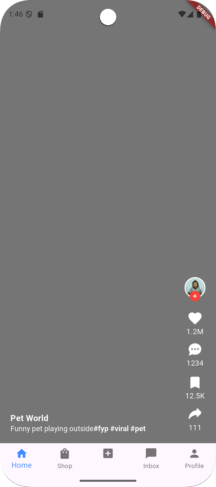
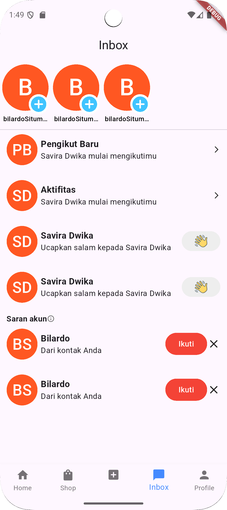
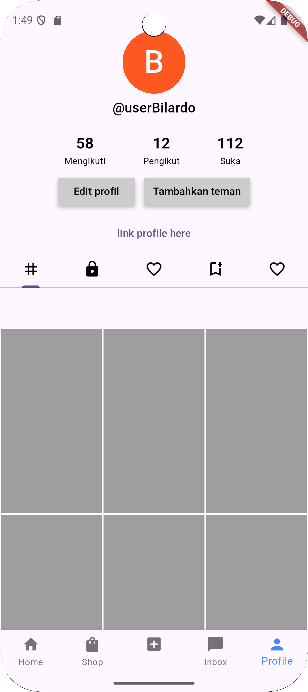

# Tiktok Social Media Application - Flutter

This application is a copycat of top social media application that have been known. 
    And the purpose of this app is to learning how to duplicate a social media app.

## 🚀 Fitur
- 📦 List of Post
- 💰 Detail Post
- 💰 Profile

## 📸 Screenshot

    
    
    

## 🔧 Instalasi
1. Clone repo:
